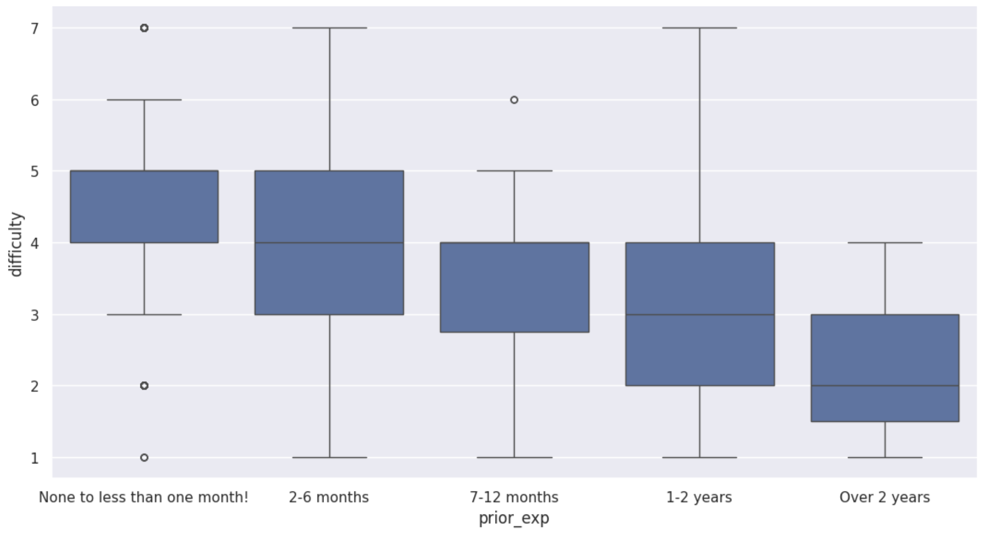
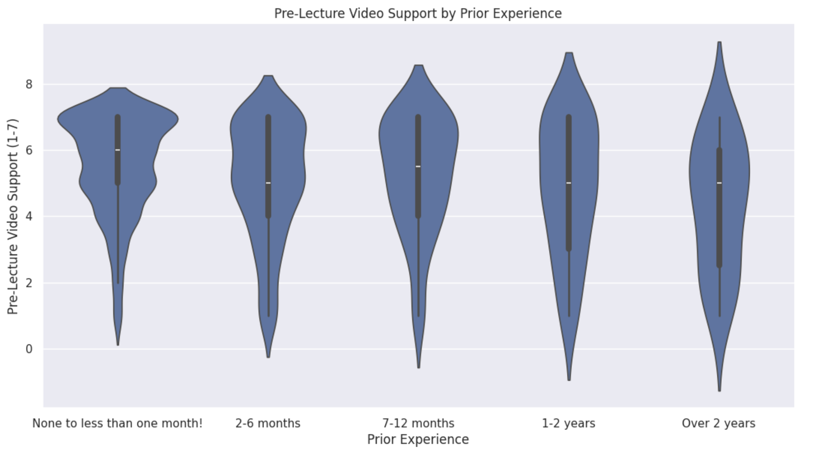
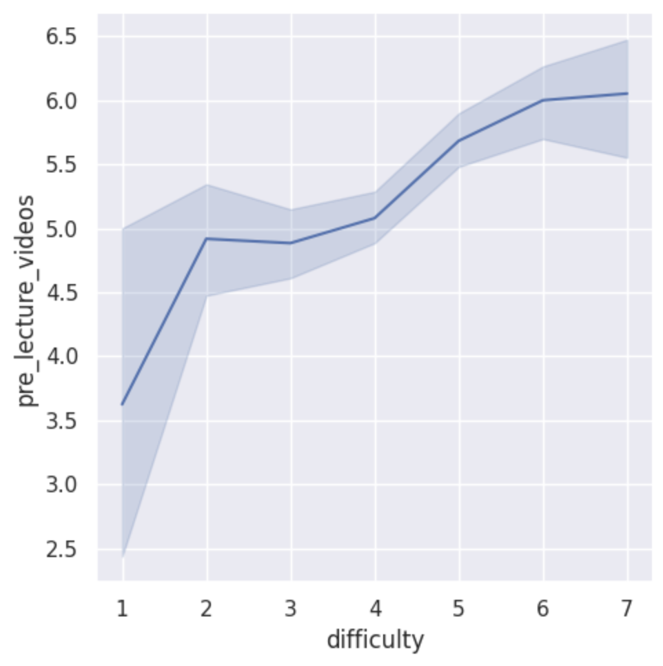

---
# Do not edit the text between these lines!
layout: default
---

# Pre-Lecture Videos: A Data-Driven Case for COMP 110

## The Idea

The course should offer optional pre-lecture videos introducing key concepts before each class. Beginners make up the largest group of students and they find the course harder, so preparatory material could help bridge that gap.

## Analysis

We combined survey data from 764 students and explored the relationship between prior experience, difficulty, understanding, and support for pre-lecture videos.

### Pre-lecture support by prior experience

<!-- Replace the path below with the path to your boxplot screenshot -->

Students with no prior experience rated the course as more difficult than students with more experience.

### Understanding by Prior Experience

<!-- Replace the path below with the path to your violin plot screenshot -->

The violin plot shows that beginners have the strongest support for pre-lecture videos, with responses concentrated around 6-7, and that all experience levels generally supported the idea.

### Difficulty vs Pre-Lecture Video Support

<!-- Replace the path below with the path to your line plot screenshot -->

As students rate the course as more difficult, their support for pre-lecture videos increases from around 4 at the lowest difficulty to about 6 at the highest, suggesting that the students who are struggling the most are the ones who want pre-lecture videos the most.

## Conclusion

The data supports offering pre-lecture videos. Beginners rated difficulty higher, understanding lower, and showed the strongest demand for this resource. A potential cost is the time it would take to create and maintain videos each semester, and some students might skip lecture if they feel the videos are enough. A future extension could be testing videos for the hardest topics first and surveying students afterward to measure effectiveness.